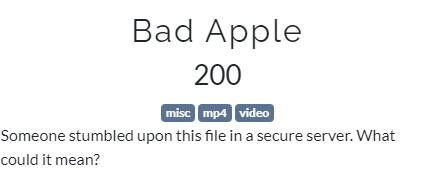
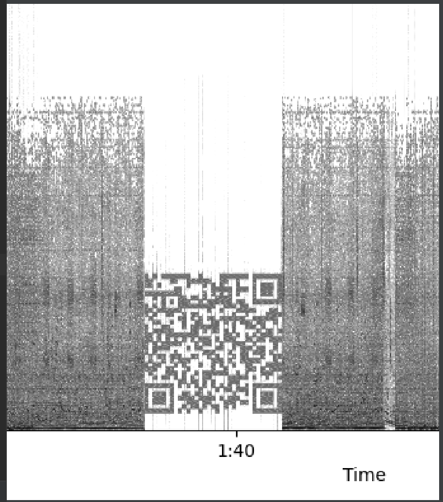
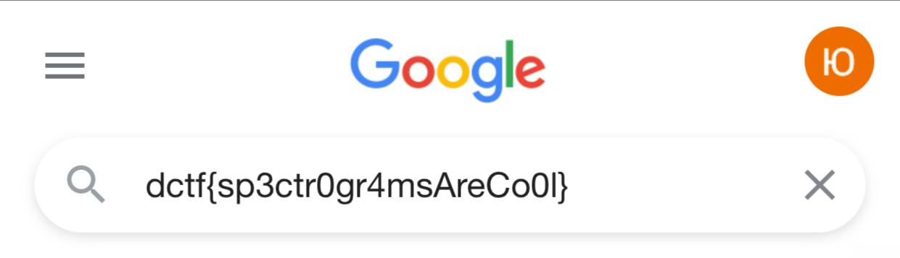

#DCTF
## Bad Apple

Category | Points 
--- | --- 
Misc| 200



- There is a video Bad_Apple.mp4. It makes sense to watch the video
- Watching this half-half-anime opening theme was interrupted by a change of music for some incomprehensible signals after about a minute of video.
- Okey, let's extract audio from video and display audio spectrogram at the desired time interval with the code

```python
import moviepy.editor as mp
import matplotlib.pyplot as plt
import librosa.display

my_clip = mp.VideoFileClip(r"Bad_Apple.mp4")
my_clip.audio.write_audiofile(r"audio.wav")
x, sr = librosa.load('audio.wav', sr=None)
X = librosa.stft(x)
Xdb = librosa.amplitude_to_db(abs(X))
plt.figure(figsize=(30, 5),)
librosa.display.specshow(Xdb, sr=sr, x_axis='time', y_axis='hz', cmap='gray_r')
plt.savefig('spectrogramA.png', bbox_inches='tight', transparent=True, pad_inches=0.0)
plt.show()
```
- Okey, we see the qr-code



- Lets read it and get the flag



flag=dctf{sp3ctr0gr4msAreCo0l}