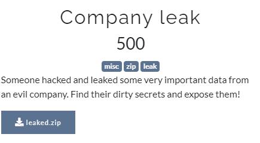
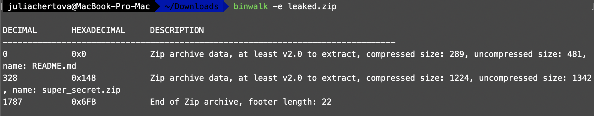
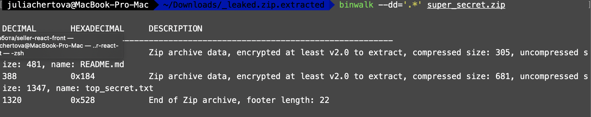
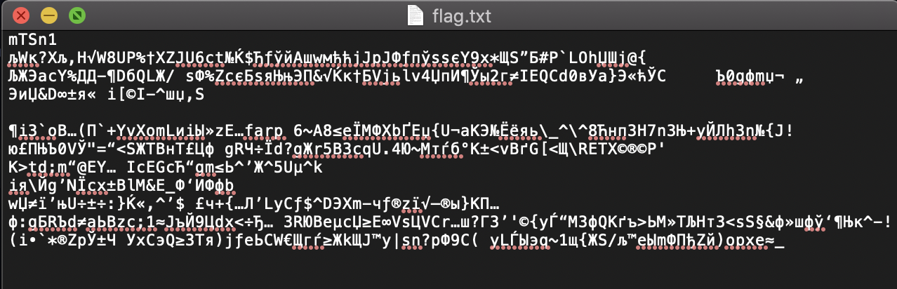
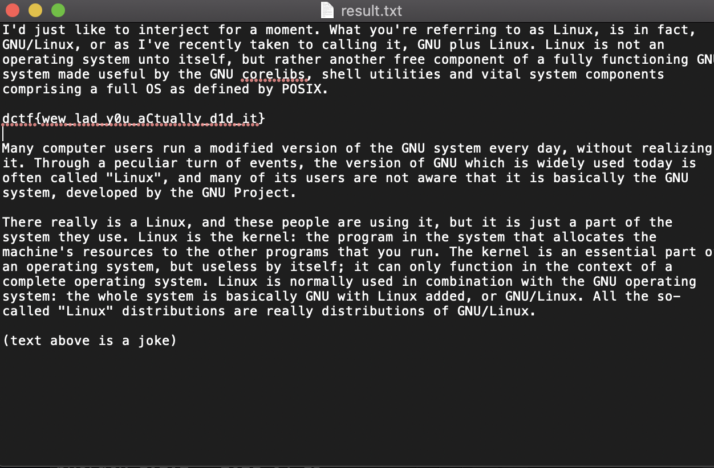

#DCTF
## Company Leak

Category | Points 
--- | --- 
Misc| 500



- We are given a zip archive containing the `README.md` file and another archive `super_secret.zip`



- Open `README.md` there is nothing interesting here

- Try to open `super_secret.zip` and we see here `top_secret.txt` (where is obviously the flag) and `README.md` again
but we can't extract it because there is password on it



- Look at that fact that there are two copies of the README.md file in here, and the sizes and CRC32 hashes of the uncompressed files are the same - we can assume that these are 2 identical files, which means that you can use a plaintext attack (or a known-plaintext attack) on zip archive. 
The `bkcrack` utility (https://github.com/kimci86/bkcrack) will help us with this.

- For the utility to work correctly, we need to archive the plaintext known to us (in our case, README.md) using the same compression method as the ciphertext was archived (in our case, we use regular zip (deflate)).

```
~/Downloads/leaked -> zip plain.zip README.md   
  adding: README.md (deflated 39%)
```
- Next run the `bkcrack` like this
- `bkcrack -C <encrypted zip> -c <encrypted text> -P <plain zip> -p <plain text>`

```
bkcrack-1.2.2-Darwin/bkcrack -C super_secret.zip -c README.md -P plain.zip -p README.md
```

- And see 

```
bkcrack 1.2.2 - 2021-04-15
[21:12:59] Z reduction using 285 bytes of known plaintext
100.0 % (285 / 285)
[21:13:00] Attack on 27016 Z values at index 7
Keys: a33fbdc6 5b49420e 6589766e
66.9 % (18062 / 27016)
[21:13:19] Keys
a33fbdc6 5b49420e 6589766e
```

- It worked. As a result, we received 3 keys, with the help of which we can extract the files of interest to us from the encrypted archive.
  
- To do this, again, use the bkcrack utility, but this way
- `bkcrack -C <enc zip> -c <cipherfile> -k *** *** *** -d <decipheredfile>`

```
bkcrack -C super_secret.zip -c top_secret.txt -k a33fbdc6 5b49420e 6589766e -d flag.txt
bkcrack 1.2.2 - 2021-04-15
[21:23:20] Writing deciphered data flag.txt (maybe compressed)
Wrote deciphered data.
```

- We are warned that data may be compressed. See `flag.txt`



- Really compressed. To "uncompress them" you can use the inflate.py utility that comes with bkcrack like this → 

```
python3 inflate.py < flag.txt > result.tx
```

- Okey, open `result.txt` and we see the flag




flag=dctf{wew_lad_y0u_aCtually_d1d_it}